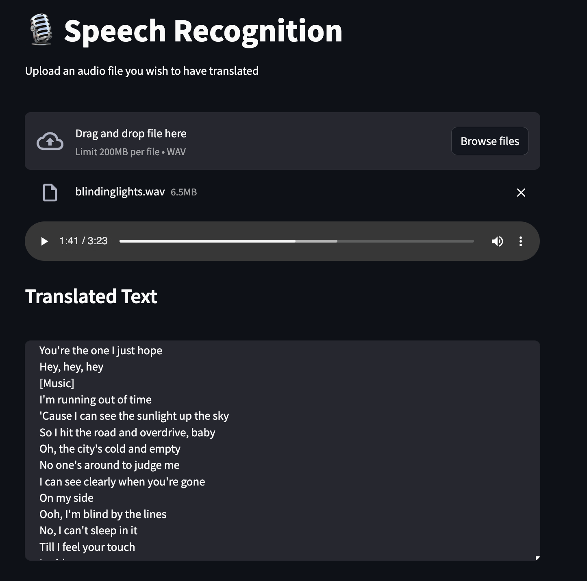
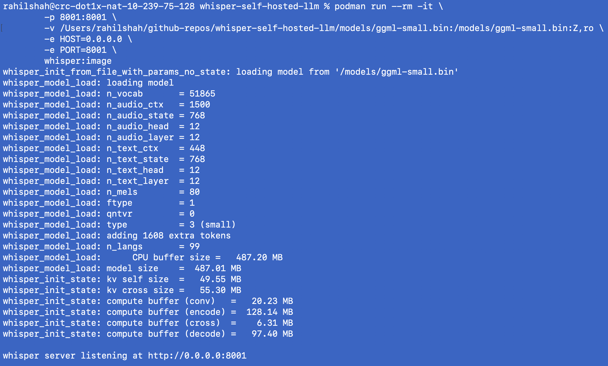

### Streamlit 

### Server

### Notes and challenges
I faced a lot of challenges trying to get the assignment to work and I had to do a lot of debugging for it to finally work. My podman machine was not working for some reason so I had to fully redownload podman. I installed podman with brew but that also was causing issues. I reinstalled podman using podman desktop but was still getting issues so I looked online till I found this https://github.com/containers/podman/issues/10824 page. I uninstalled every brew package I downloaded, uninstalled podman, uninstalled podman desktop. I then removed all the versions of podman from my computer and removed all the directories that the repo said to. I also deleted all the images. I finally reinstalled podman desktop, downloaded podman from it, and it worked. It was really annoying to keep debugging but I'm glad it worked out in the end!
