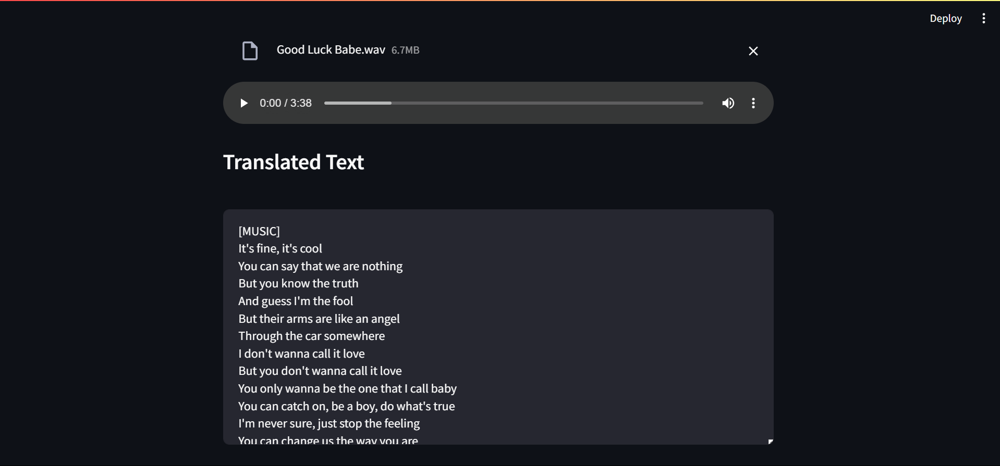
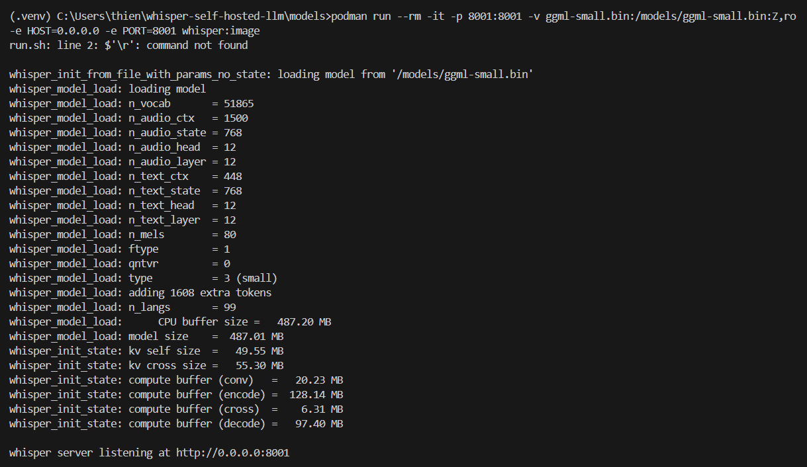

 

Pretty much all of my problems were because I was on Windows.

1. wget and ffmpeg don't work on Windows - you either have to go out and install the executables and add it to your path, OR just use WSL.

2. Backslashes (\) don't denote line continuation on Windows. Use carets (^) or use WSL.

3. Couldn't install streamlit for some reason - got a WinError. I ended up making a virtual environment.

4. Couldn't connect to the whisper server. I had to change whisper-client.py to point to "http://localhost:8001/inference" instead of "http://0.0.0.0:8001/inference"
